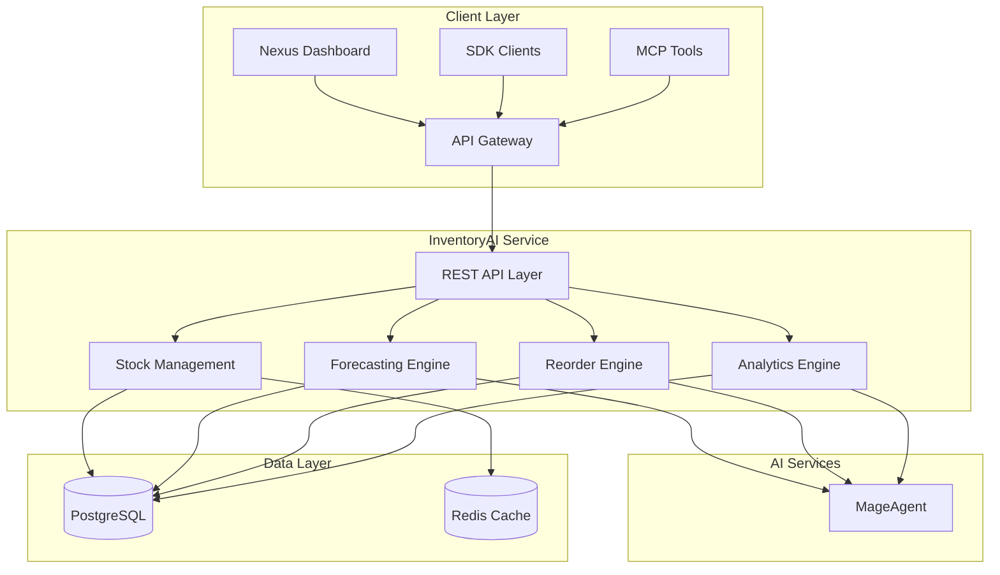
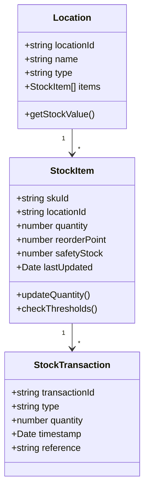
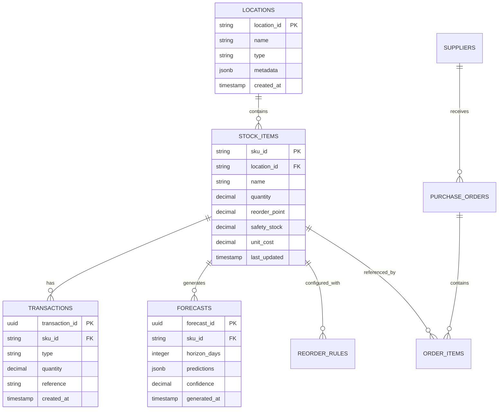
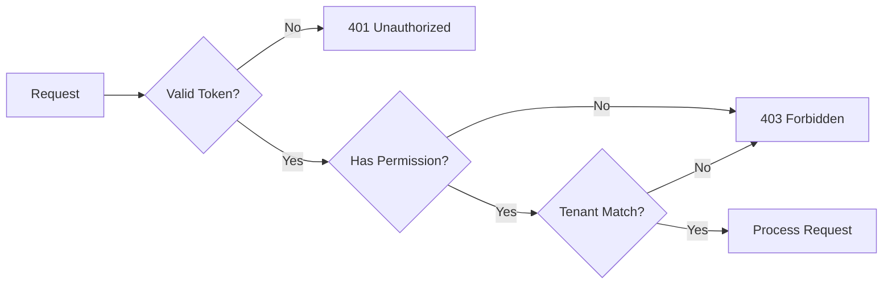
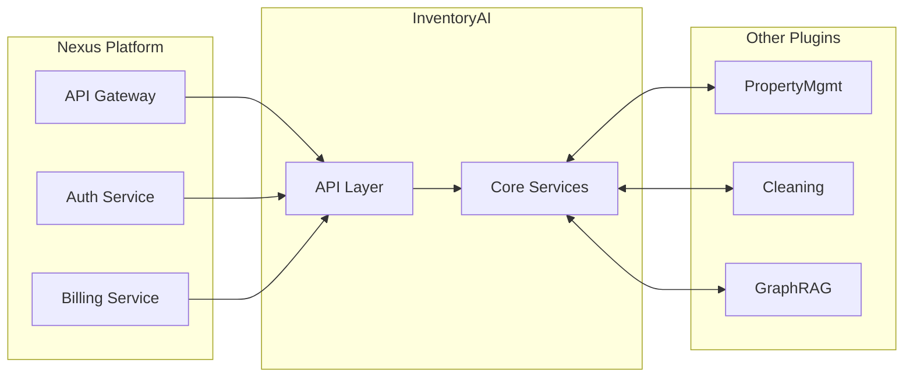

# InventoryAI Architecture

Technical architecture and system design for the InventoryAI plugin.

---

## System Overview



---

## Core Components

### 1. REST API Layer

Handles all incoming requests with authentication, rate limiting, and request validation.

| Endpoint | Method | Description |
|----------|--------|-------------|
| `/api/v1/stock` | GET | Get current stock levels |
| `/api/v1/forecast` | POST | Generate demand forecast |
| `/api/v1/reorder` | POST | Create reorder recommendation |
| `/api/v1/analytics` | GET | Get inventory analytics |

### 2. Stock Management Module

Tracks inventory levels across locations with real-time updates.



### 3. Forecasting Engine

AI-powered demand prediction using MageAgent.

**Capabilities:**
- Time-series analysis with seasonality detection
- External factor integration (bookings, events, weather)
- Confidence interval calculation
- Multi-horizon forecasting (7, 14, 30, 90 days)

**Model Architecture:**
- Base: ARIMA with seasonal decomposition
- Enhancement: Gradient boosting for external factors
- Calibration: Bayesian updating with recent actuals

### 4. Reorder Engine

Automated purchase order generation with supplier optimization.

**Features:**
- Economic Order Quantity (EOQ) calculation
- Lead time optimization
- Supplier consolidation
- Volume discount capture

### 5. Analytics Engine

Real-time KPI calculation and trend analysis.

**Metrics:**
- Inventory turnover ratio
- Stockout rate
- Carrying cost percentage
- Fill rate
- Dead stock percentage

---

## Data Model



---

## Security Model

### Authentication
- Bearer token authentication via Nexus API Gateway
- JWT token validation with RS256 signing
- API key rotation support

### Authorization
- Role-based access control (RBAC)
- Tenant isolation at database level
- Location-level permissions



### Data Protection
- AES-256 encryption at rest
- TLS 1.3 in transit
- PII masking in logs
- Audit trail for all operations

---

## Deployment Architecture

### Kubernetes Configuration

```yaml
apiVersion: apps/v1
kind: Deployment
metadata:
  name: nexus-inventory
  namespace: nexus-plugins
spec:
  replicas: 3
  selector:
    matchLabels:
      app: nexus-inventory
  template:
    metadata:
      labels:
        app: nexus-inventory
    spec:
      containers:
      - name: inventory-api
        image: adverant/nexus-inventory:1.0.0
        ports:
        - containerPort: 8080
        resources:
          requests:
            memory: "1Gi"
            cpu: "500m"
          limits:
            memory: "2Gi"
            cpu: "1000m"
        env:
        - name: DATABASE_URL
          valueFrom:
            secretKeyRef:
              name: inventory-secrets
              key: database-url
        - name: REDIS_URL
          valueFrom:
            secretKeyRef:
              name: inventory-secrets
              key: redis-url
        livenessProbe:
          httpGet:
            path: /live
            port: 8080
          initialDelaySeconds: 30
          periodSeconds: 10
        readinessProbe:
          httpGet:
            path: /ready
            port: 8080
          initialDelaySeconds: 5
          periodSeconds: 5
```

### Resource Allocation

| Resource | Request | Limit |
|----------|---------|-------|
| CPU | 500m | 1000m |
| Memory | 1Gi | 2Gi |
| Disk | 5Gi | 10Gi |

---

## Integration Points

### Nexus Platform



### MageAgent Integration

InventoryAI leverages MageAgent for AI-powered features:

- **Demand Forecasting**: Time-series prediction with external factors
- **Anomaly Detection**: Unusual consumption pattern alerts
- **Natural Language Queries**: "What's my fastest-moving SKU?"

### Event Bus

Publishes events for cross-plugin integration:

| Event | Payload | Subscribers |
|-------|---------|-------------|
| `inventory.stock.low` | SKU, location, level | Alerting, Reorder |
| `inventory.reorder.created` | PO details | Procurement, Billing |
| `inventory.forecast.generated` | Predictions | Dashboard, Reports |

---

## Performance Considerations

### Caching Strategy

- **L1 Cache**: In-memory for hot data (stock levels)
- **L2 Cache**: Redis for session and computed data
- **TTL**: 60 seconds for stock, 5 minutes for analytics

### Scaling

- Horizontal scaling with stateless API pods
- Read replicas for analytics queries
- Async processing for forecasting jobs

### Rate Limits

| Tier | Requests/min | Burst |
|------|--------------|-------|
| Starter | 60 | 100 |
| Professional | 300 | 500 |
| Enterprise | Custom | Custom |

---

## Monitoring & Observability

### Metrics (Prometheus)

```
# Stock metrics
inventory_stock_level{sku, location}
inventory_stockout_total{sku, location}
inventory_reorder_created_total

# API metrics
inventory_api_requests_total{endpoint, status}
inventory_api_latency_seconds{endpoint}

# Forecast metrics
inventory_forecast_accuracy{horizon}
inventory_forecast_duration_seconds
```

### Logging

Structured JSON logging with correlation IDs:

```json
{
  "timestamp": "2025-01-01T10:30:00Z",
  "level": "INFO",
  "correlationId": "abc-123",
  "service": "inventory-api",
  "message": "Forecast generated",
  "context": {
    "skuCount": 50,
    "horizonDays": 30,
    "durationMs": 1250
  }
}
```

### Alerting

| Alert | Condition | Severity |
|-------|-----------|----------|
| High Stockout Rate | > 5% SKUs out of stock | Critical |
| Forecast Degradation | Accuracy < 80% | Warning |
| API Latency | P99 > 500ms | Warning |

---

## Disaster Recovery

- **RPO**: 1 hour (point-in-time recovery)
- **RTO**: 15 minutes (automated failover)
- **Backup**: Daily full, hourly incremental
- **Multi-region**: Active-passive with automatic failover

---

## Next Steps

- [Quick Start Guide](./QUICKSTART.md) - Get started in 5 minutes
- [Use Cases](./USE-CASES.md) - Implementation scenarios
- [API Reference](./docs/api-reference/endpoints.md) - Complete docs
