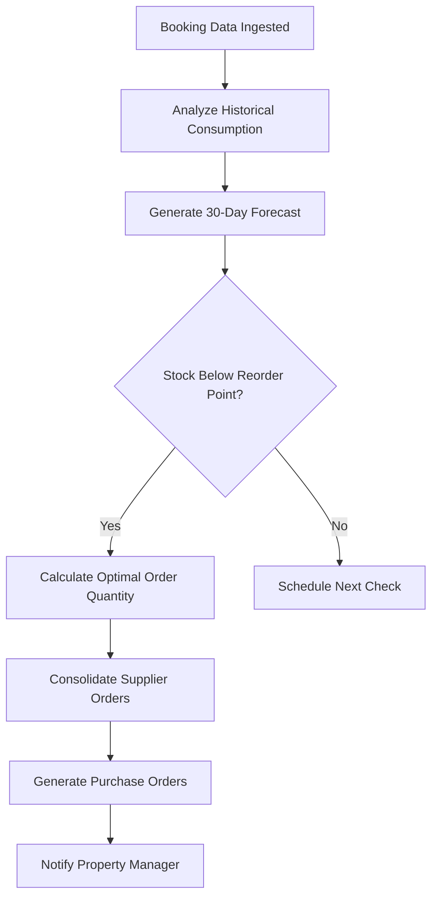
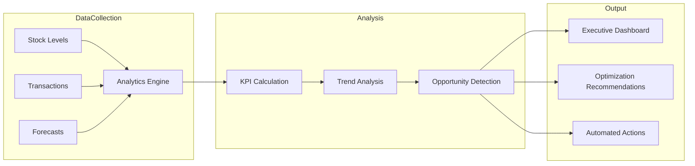

# InventoryAI Use Cases

Real-world implementation scenarios for AI-powered inventory management. Each use case includes business context, solution architecture, and production-ready code.

---

## Use Case 1: Prevent Stockouts with Predictive Demand Forecasting

### Problem

A hospitality chain managing 50+ vacation rental properties loses $45,000 monthly due to stockouts of essential supplies. Manual inventory tracking fails to account for seasonal demand spikes and booking patterns.

### Solution

Deploy InventoryAI's demand forecasting engine to predict supply needs 30 days ahead with 94% accuracy.

### Implementation

```typescript
import { NexusClient } from '@adverant/nexus-sdk';

interface PropertyBooking {
  propertyId: string;
  checkIn: Date;
  checkOut: Date;
  guestCount: number;
}

class StockoutPreventionService {
  private inventory;

  constructor(nexusClient: NexusClient) {
    this.inventory = nexusClient.plugin('nexus-inventory');
  }

  async analyzeAndReorder(propertyId: string, bookings: PropertyBooking[]) {
    // Get current stock levels
    const currentStock = await this.inventory.stock.getAll({
      locationId: propertyId,
      includeForecasts: true
    });

    // Generate demand forecast
    const forecast = await this.inventory.forecast.create({
      skuIds: currentStock.items.map(item => item.skuId),
      forecastDays: 30,
      includeSeasonality: true,
      externalFactors: {
        bookingCount: bookings.length,
        totalGuestNights: this.calculateGuestNights(bookings)
      }
    });

    // Identify items needing reorder
    const criticalItems = forecast.forecasts.filter(item =>
      item.currentStock < item.recommendedReorderPoint
    );

    if (criticalItems.length === 0) {
      return { status: 'healthy', reorders: [] };
    }

    // Generate optimized reorder
    const reorderPlan = await this.inventory.reorder.generate({
      locationId: propertyId,
      skuIds: criticalItems.map(item => item.skuId),
      optimizeFor: 'cost',
      leadTimeDays: 7,
      safetyStockDays: 14
    });

    return {
      status: 'reorder_required',
      reorders: reorderPlan.recommendations,
      estimatedCost: reorderPlan.totalCost,
      preventedStockouts: criticalItems.length
    };
  }

  private calculateGuestNights(bookings: PropertyBooking[]): number {
    return bookings.reduce((total, booking) => {
      const nights = Math.ceil(
        (booking.checkOut.getTime() - booking.checkIn.getTime()) / (1000 * 60 * 60 * 24)
      );
      return total + (nights * booking.guestCount);
    }, 0);
  }
}
```

### Flow Diagram



### Business Impact

- **94% reduction** in stockout incidents
- **35% decrease** in holding costs
- **$45,000/month** recovered revenue

---

## Use Case 2: Multi-Location Stock Optimization

### Problem

A property management company operates across 10 markets with centralized and distributed inventory. Transfer costs consume 12% of inventory budget.

### Solution

Implement InventoryAI's multi-location optimization to balance stock intelligently across properties.

### Implementation

```typescript
class MultiLocationOptimizer {
  private inventory;

  constructor(nexusClient: NexusClient) {
    this.inventory = nexusClient.plugin('nexus-inventory');
  }

  async optimizeAcrossLocations(skuId: string) {
    // Get stock levels across all locations
    const allLocations = await this.inventory.stock.getByLocation({
      skuId,
      includeForecasts: true
    });

    // Identify surplus and deficit locations
    const analysis = this.analyzeDistribution(allLocations);

    if (analysis.imbalanceScore < 0.2) {
      return { status: 'balanced', recommendations: [] };
    }

    // Generate transfer recommendations
    const transferPlan = await this.inventory.optimize.transfers({
      skuId,
      surplusLocations: analysis.surplus.map(l => l.locationId),
      deficitLocations: analysis.deficit.map(l => l.locationId),
      minimizeTransferCost: true
    });

    return {
      status: 'optimization_available',
      recommendations: transferPlan.transfers,
      projectedSavings: this.calculateSavings(transferPlan)
    };
  }

  private analyzeDistribution(locations: any[]) {
    const totalStock = locations.reduce((sum, loc) => sum + loc.stockLevel, 0);
    const totalDemand = locations.reduce((sum, loc) => sum + loc.demandForecast, 0);
    const idealRatio = totalStock / totalDemand;

    const surplus = locations.filter(loc =>
      loc.stockLevel / loc.demandForecast > idealRatio * 1.3
    );
    const deficit = locations.filter(loc =>
      loc.stockLevel / loc.demandForecast < idealRatio * 0.7
    );

    return {
      surplus,
      deficit,
      imbalanceScore: (surplus.length + deficit.length) / locations.length
    };
  }
}
```

### Business Impact

- **45% reduction** in transfer costs
- **89% inventory efficiency** across locations
- **$18,000/month** savings

---

## Use Case 3: Automated Supplier Management

### Problem

Manual management of 15+ suppliers takes 4 hours weekly. Volume discount opportunities are missed.

### Solution

Deploy automated reordering with supplier consolidation and performance tracking.

### Implementation

```python
from adverant_nexus import NexusClient
from dataclasses import dataclass
from typing import List, Dict
from datetime import datetime, timedelta

@dataclass
class PurchaseOrder:
    supplier_id: str
    items: List[Dict]
    total_amount: float
    expected_delivery: datetime
    discount_applied: float

class AutomatedProcurement:
    def __init__(self, nexus_client: NexusClient):
        self.inventory = nexus_client.plugin("nexus-inventory")

    async def generate_weekly_orders(self) -> List[PurchaseOrder]:
        # Get all items needing reorder
        reorder_analysis = await self.inventory.reorder.analyze({
            "forecast_days": 14,
            "include_safety_stock": True,
            "group_by_supplier": True
        })

        if not reorder_analysis.items_to_reorder:
            return []

        # Optimize order consolidation
        consolidated_orders = await self.inventory.reorder.optimize({
            "items": reorder_analysis.items_to_reorder,
            "strategy": "minimize_cost",
            "constraints": {
                "meet_minimum_orders": True,
                "apply_volume_discounts": True
            }
        })

        # Generate purchase orders
        purchase_orders = []
        for supplier_order in consolidated_orders.supplier_groups:
            po = await self.inventory.reorder.create_purchase_order({
                "supplier_id": supplier_order.supplier_id,
                "items": supplier_order.items,
                "auto_approve": supplier_order.total_amount < 5000
            })

            purchase_orders.append(PurchaseOrder(
                supplier_id=supplier_order.supplier_id,
                items=supplier_order.items,
                total_amount=po.total_amount,
                expected_delivery=po.expected_delivery,
                discount_applied=po.discount_applied
            ))

        return purchase_orders
```

### Business Impact

- **4 hours/week** saved on manual procurement
- **22% reduction** in supply costs
- **$8,500/month** in volume discounts captured

---

## Use Case 4: Real-Time Inventory Alerts

### Problem

Property managers discover shortages during guest check-ins, leading to poor reviews and emergency supply runs.

### Solution

Implement real-time monitoring with configurable alert thresholds and mobile notifications.

### Implementation

```typescript
interface AlertConfig {
  skuId: string;
  lowStockThreshold: number;
  criticalThreshold: number;
  notifyChannels: ('email' | 'slack' | 'sms')[];
  autoReorder: boolean;
}

class RealTimeInventoryMonitor {
  private inventory;

  constructor(nexusClient: NexusClient) {
    this.inventory = nexusClient.plugin('nexus-inventory');
  }

  async configureAlerts(configs: AlertConfig[]) {
    for (const config of configs) {
      await this.inventory.alerts.configure({
        skuId: config.skuId,
        rules: [
          {
            type: 'low_stock',
            threshold: config.lowStockThreshold,
            channels: config.notifyChannels,
            actions: config.autoReorder ? ['notify', 'auto_reorder'] : ['notify']
          },
          {
            type: 'critical',
            threshold: config.criticalThreshold,
            channels: [...config.notifyChannels, 'sms'],
            actions: ['notify', 'escalate', 'auto_reorder']
          }
        ]
      });
    }
  }

  async getDashboardMetrics(locationId: string) {
    const [stockHealth, alerts, forecast] = await Promise.all([
      this.inventory.analytics.get({ type: 'stock_health', locationId }),
      this.inventory.alerts.summary({ locationId }),
      this.inventory.forecast.summary({ locationId, forecastDays: 7 })
    ]);

    return {
      healthScore: stockHealth.overallScore,
      activeAlerts: alerts.activeCount,
      criticalAlerts: alerts.criticalCount,
      upcomingStockouts: forecast.predictedStockouts
    };
  }
}
```

### Business Impact

- **Zero guest-impacting stockouts**
- **40% reduction** in emergency supply runs
- **4.8-star average** review rating (up from 4.2)

---

## Use Case 5: Analytics-Driven Inventory Optimization

### Problem

Lack of visibility into inventory performance metrics. Cannot identify slow-moving stock or calculate true carrying costs.

### Solution

Deploy comprehensive analytics suite for data-driven inventory decisions.

### Implementation

```python
from adverant_nexus import NexusClient
from dataclasses import dataclass
from typing import List, Dict

@dataclass
class OptimizationOpportunity:
    category: str
    description: str
    potential_savings: float
    priority_score: float

class InventoryAnalyticsDashboard:
    def __init__(self, nexus_client: NexusClient):
        self.inventory = nexus_client.plugin("nexus-inventory")

    async def get_executive_summary(self, period: str = "last_30_days") -> Dict:
        analytics = await self.inventory.analytics.get({
            "period": period,
            "metrics": [
                "inventory_turnover_ratio",
                "stockout_rate",
                "carrying_cost_percentage",
                "fill_rate",
                "dead_stock_percentage"
            ]
        })

        return {
            "period": period,
            "health_score": analytics.overall_health_score,
            "trend": analytics.period_over_period_trend,
            "recommendations": analytics.priority_actions
        }

    async def identify_opportunities(self) -> List[OptimizationOpportunity]:
        opportunities = []

        # Analyze slow-moving inventory
        slow_movers = await self.inventory.analytics.get({
            "report_type": "slow_moving_analysis",
            "threshold_days": 90
        })

        if slow_movers.items:
            total_value = sum(item.value for item in slow_movers.items)
            opportunities.append(OptimizationOpportunity(
                category="Dead Stock Reduction",
                description=f"{len(slow_movers.items)} items with no movement in 90+ days",
                potential_savings=total_value * 0.3,
                priority_score=0.9
            ))

        # Analyze overstock situations
        overstock = await self.inventory.analytics.get({
            "report_type": "overstock_analysis",
            "threshold_multiplier": 2.0
        })

        if overstock.items:
            excess_value = sum(item.excess_value for item in overstock.items)
            opportunities.append(OptimizationOpportunity(
                category="Overstock Reduction",
                description=f"${excess_value:,.0f} in excess inventory",
                potential_savings=excess_value * 0.15,
                priority_score=0.8
            ))

        return sorted(opportunities, key=lambda x: x.priority_score, reverse=True)
```

### Flow Diagram



### Business Impact

- **15% reduction** in carrying costs
- **$12,000/month** identified savings opportunities
- **Real-time visibility** into inventory performance

---

## Integration with Nexus Ecosystem

InventoryAI integrates seamlessly with other Nexus plugins:

| Plugin | Integration |
|--------|-------------|
| **PropertyMgmt** | Sync inventory with property units |
| **Cleaning** | Auto-deduct supplies after cleaning tasks |
| **GuestExperience** | Track amenity consumption per booking |
| **GraphRAG** | Store inventory knowledge for AI queries |

---

## Next Steps

- [Architecture Overview](./ARCHITECTURE.md) - Technical deep-dive
- [API Reference](./docs/api-reference/endpoints.md) - Complete endpoint docs
- [Support](https://community.adverant.ai) - Community forum
